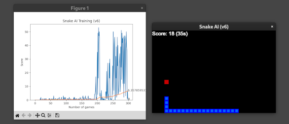

# AI Snake Game


## Table of Contents

* [Snake Game Description](#snake-game-description)
* [Development Environment](#development-environment)
* [AI Training Visualization](#ai-training-visualization)
* [Motivation for this Project](#motivation-for-this-project)
* [A Bit About Me](#a-bit-about-me)
* [Acknowlegements](#acknowlegements)

## Snake Game Description

This project is an implementation of the *Snake* game with an AI agent playing it. The Snake game is a simple video game where the user controls a *Snake* using the arrow keys. The goal is to eat as many *food* blocks as possible. The game is over when the snake hits the edge of the game screen or hits itself.



This project has the AI playing the game. You just get to watch and/or tweak the code to see what happens! The game automatically restarts whenever the AI crashes the snake into itself or the wall. Or if you close the window.

You can pause the game by pressing **p** on your keyboard and restart it by pressing the **space** bar

## Development Environment

I'm running Debian Linux at home, but this project is totally portable. You can run the code on Linux, Windows or on Apple quite easily. The only pre-requisites are:

* [Python 3](https://python.org)
* [Git](https://git-scm.com/)
* [PyTorch](https://pytorch.org)
* [PyGame](https://www.pygame.org/)
* [MatPlotLib](https://matplotlib.org/)
* [IPython](https://ipython.org/)

Here's me setting up my Linux environment, downloding this code and running it:
```
# Create a Python 3 virtual environment called ai_dev
$ python3 venv ai_dev
# Active the new environment
$ . ai_dev/bin/activate
# Install PyTorch
(ai_dev) $ pip3 install torch torchvision torchaudio --index-url https://download.pytorch.org/whl/cpu
# Install Pygame, MatPlotLib and IPython libraries
(ai_dev) $ pip3 install pygame, matplotlib, IPython
# Get this code
$ git clone git@github.com/Nadim/Ghaznavi/ai
$ cd ai/snake
# Run the game with the AI agent player
$ python agent.py
```
## AI Training Visualization

Running the code cause a dynamic MatPlotLib window to popup. The window contains a graph showing the score and the average score over time.


          
## Motivation for this Project

It has seemed clear to me that AI is the hottest technology on the planet and I wanted to get involved. Like when I was trying to learn Linux, learning AI didn't seem like it had a *steep learning curve*, it had a *learning cliff*. I'm not a mathematician, so that already seemed to present a significant handicap. I tried a number of tutorials and courses, but I coudn't seem to get any traction. Then I stumbled across a [YouTube video](https://www.youtube.com/watch?v=L8ypSXwyBds&t=1042s&ab_channel=freeCodeCamp.org) by [Patrick Loeber](https://www.youtube.com/channel/UCbXgNpp0jedKWcQiULLbDTA).

It walked me through the process of creating the Snake Game and an AI agent to play it. That was a turning point for me. I continue to study Machine Learning and AI development generally. The Snake Game provided me with a concrete project where I could apply the knowledge I was gaining in ML and AI development.

As of January 2025, I'm continuing to develop and enhance this project.

## A Bit About Me

My background is as a Linux Systems Administrator with over two decades of experience. I've mostly worked in large enterprise computing organizations like the Canada Revenue Agency, CIBC, BMO, Morgan Stanley, Merrill Lynch, Cadence Design Software and Moneris Payment Solutions. I've also worked in smaller shops like SiGe Semiconductor, CADlink and Keek.

I have a very, very diverse skillset including coding, databases, backend and GUI development.

## Acknowledgements

The code in this project is based on a [YouTube video](https://www.youtube.com/watch?v=L8ypSXwyBds&t=1042s&ab_channel=freeCodeCamp.org) by [Patrick Loeber](https://www.youtube.com/channel/UCbXgNpp0jedKWcQiULLbDTA) and is part of the [Free Code Camp](https://www.youtube.com/@freecodecamp) project. The code from the video is on [GitHub](https://github.com/patrickloeber/snake-ai-pytorch).

Thank you Patrick, you're awesome!!!!! :)

